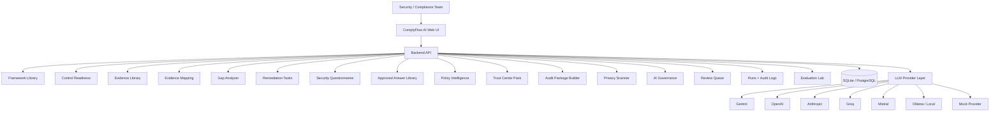
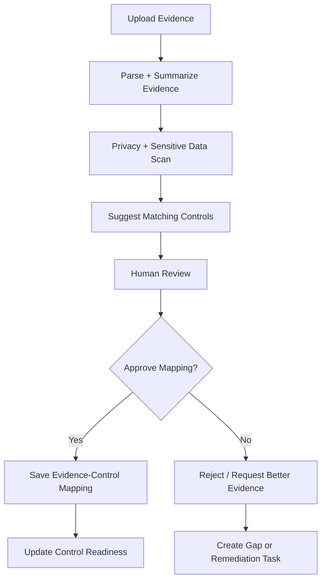
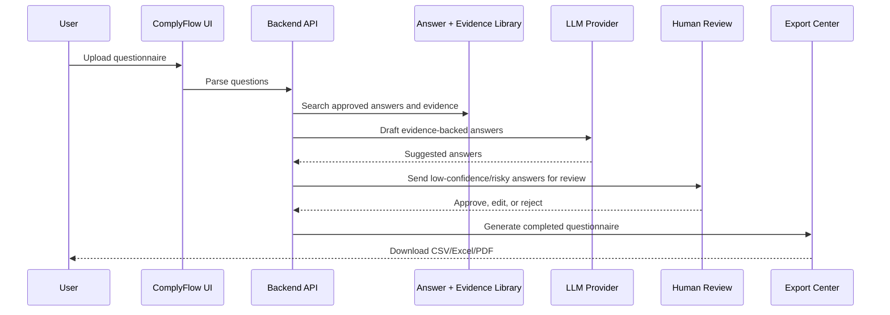
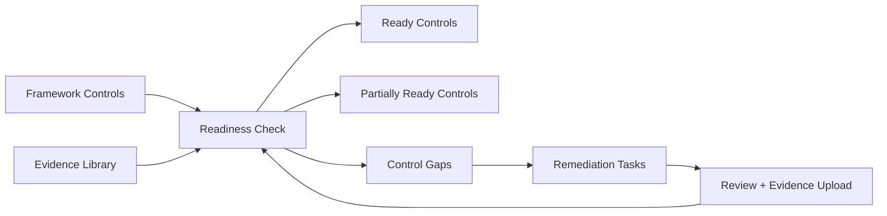
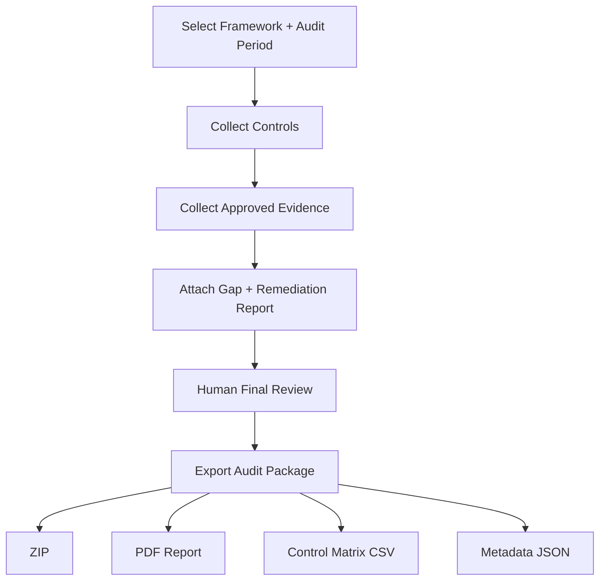
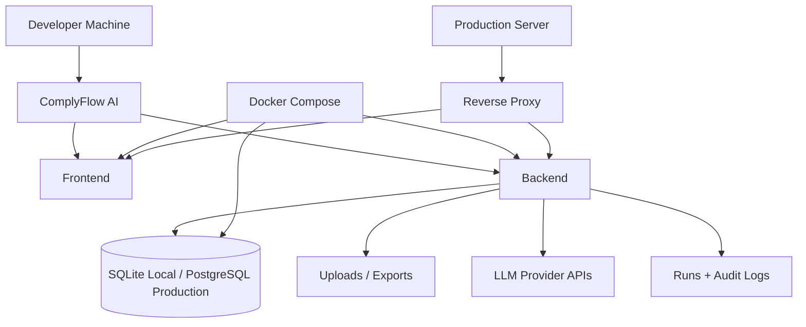

# ComplyFlow AI
### *The Open-Source AI Compliance Operating System for Evidence Mapping, Security Questionnaires, Gap Analysis, and Audit Readiness*

---

## 1. Product Name & Tagline
**ComplyFlow AI** — An AI compliance copilot for evidence mapping, security questionnaires, control readiness, and audit preparation.

---

## 2. Problem Statement
Preparing for security audits (like SOC 2 and ISO 27001) or privacy reviews (like GDPR and EU AI Act) is a tedious, manual process. Teams struggle to:
- Map messy corporate policies and configuration logs to specific framework criteria.
- Respond to vendor security questionnaires accurately without inventing compliance assertions.
- Track stale or expired evidence across different audit periods.
- Prevent confidential internal evidence parameters from leaking into public trust portals.
- Maintain a reusable, verified knowledge base of approved answers.

---

## 3. Who It Is For
- **SaaS Founders** preparing for their first SOC 2 Type I/II or ISO 27001 audit.
- **Security & Compliance (GRC) Teams** managing internal audits and policy frameworks.
- **Privacy & Privacy Impact Assessment (PIA) Officers** tracing GDPR registries and data flows.
- **Sales & Customer Success Engineers** answering enterprise vendor security questionnaires.
- **AI Governance Teams** inventorying model registries and checking EU AI Act compliance.

---

## 4. Why ComplyFlow AI Exists
ComplyFlow AI bridges the gap between static compliance checklists and smart evidence management. Instead of acting as a generic compliance chatbot, it behaves like a **compliance analyst + security questionnaire assistant + evidence manager + audit-prep workspace**. Every drafted response and control assertion is strictly grounded in the physical documents stored in your local Evidence Library, with human-in-the-loop validation gates.

---

## 5. Market Gap
- **Checklist-only tools** help you list items, but don't check if your uploaded PDF proves the control is operating.
- **Generic AI chat tools** hallucinate answers, suggesting you have ISO certifications or MFA policies that do not exist in your files.
- **Trust Portals** expose sensitive operational files to third parties without confidentiality filters.
- **AI Regulations (ISO 42001, EU AI Act)** lack simple GRC management templates for small teams.

ComplyFlow AI addresses these issues by providing an **evidence-backed, control-aware, review-driven, and export-ready** platform.

---

## 6. Key Features
- **Compliance Dashboard**: KPI tracking, framework coverage summaries, stale evidence alerts, and sync activity.
- **Framework Template Library**: Pre-loaded criteria for SOC 2, ISO 27001, GDPR, AI Governance (ISO 42001), and EU AI Act.
- **Control Readiness Workspace**: Real-time status checks, manually adjust reviewer state, and record audit notes.
- **Grounded Evidence Library**: Upload PDF, DOCX, CSV, XLSX, JSON, and MD files. Track valid dates, freshness, and confidentiality labels.
- **Evidence-to-Control Mapping Engine**: Similarity matching utilizing local vector indexes (with TF-IDF fallback) and multi-provider LLM analysis.
- **Compliance Gap Analyzer**: Highlight missing, weak, or conflicting evidence items, and generate remediation actions.
- **Remediation Task Manager**: Direct task creation from gaps with owner assignments, due dates, and priorities.
- **Security Questionnaire Workspace**: Import spreadsheets or paste questions to draft evidence-backed responses with source quotes.
- **Approved Answer Library**: Maintain standard reusable security answers for recurring RFPs.
- **Policy Intelligence**: Extract owner scopes, core commitments, and highlight formatting or structural policy findings.
- **Trust Center Pack Builder**: Generate safe, public-facing summaries that exclude confidential quotes.
- **Collaborative Auditor Portal**: External auditor reviews, comments logs, and Cryptographic Lock receipts.
- **Privacy Scanner**: Real-time PII and secret scanner redacting keys, emails, phone numbers, and credit cards.
- **AI Governance Registry**: Model inventories, risk classifications, logging checks, and human override logs.
- **Runs & Observability Logs**: Read-only ledger of executions, latency, token costs, and system audit logs.
- **Evaluation Lab**: Regression tests checking mapping precision against standard fixtures.
- **Multi-Provider Adapter**: Native integrations for Gemini, OpenAI, Anthropic, Groq, Mistral, Ollama, Custom OpenAI, or offline Mock fallback.
- **Persistent Database**: Complete SQLite storage for GRC assets, NDAs, auditor comments, overrides, and logs.

---

## 7. Screenshots & UI Previews
*(Placeholders for GRC Dashboard and Auditor Portal screens)*


---

## 8. Full Workflow Overview
The ComplyFlow compliance path follows this simple progression:
1. **Ingest**: Upload policies and configuration files into the **Evidence Library**.
2. **Scan**: Run the **Privacy Scanner** to strip secrets/PII.
3. **Map**: Bind evidence to controls via the **Mapping Engine** (verified by GRC reviews).
4. **Remediate**: Detect gaps, create **Remediation Tasks**, and upload replacement logs.
5. **Respond**: Import security questionnaires and generate grounded, verified answers.
6. **Publish & Freeze**: Build a public **Trust Center Pack** and generate a cryptographic **Audit Freeze Lock** for auditors.

---

## 9. Architecture Diagram



---

## 10. Evidence Ingestion Workflow



---

## 11. Security Questionnaire Workflow



---

## 12. Gap Analysis Workflow



---

## 13. Audit Package Workflow



---

## 14. Deployment Blueprint



---

## 15. Installation & Local Setup

### Prerequisites
- Python 3.10 or higher
- Git

### Quickstart Commands
```bash
# Clone the repository
git clone https://github.com/username/complyflow-ai.git
cd complyflow-ai

# Create virtual environment
python -m venv .venv
source .venv/bin/activate  # On Windows: .\.venv\Scripts\activate

# Install dependencies
pip install -r requirements.txt

# Configure environment variables
cp .env.example .env

# Seed database with sample controls and evidence items
python -m src.seed_data

# Launch Streamlit web portal
streamlit run app.py
```

---

## 16. Environment Variables
The application reads configuration parameters from a `.env` file in the root directory:

```env
APP_MODE=local
MOCK_MODE=true

LLM_PROVIDER=mock

GEMINI_API_KEY=
GEMINI_MODEL=gemini-1.5-flash

OPENAI_API_KEY=
OPENAI_MODEL=gpt-4o-mini

ANTHROPIC_API_KEY=
ANTHROPIC_MODEL=claude-3-5-sonnet-latest

GROQ_API_KEY=
GROQ_MODEL=llama-3.1-70b-versatile

MISTRAL_API_KEY=
MISTRAL_MODEL=mistral-large-latest

OLLAMA_BASE_URL=http://localhost:11434
OLLAMA_MODEL=llama3.1

CUSTOM_OPENAI_BASE_URL=
CUSTOM_OPENAI_API_KEY=
CUSTOM_OPENAI_MODEL=

DATABASE_URL=sqlite:///complyflow.db
MAX_UPLOAD_MB=50
ENABLE_OCR=false
ENABLE_DEMO_DATA=true
```

---

## 17. LLM Provider Setup
You do not need paid credentials to test the platform. Keep `MOCK_MODE=true` inside `.env` to execute queries against local semantic mappings and text template catalogs.

To enable live LLM mappings:
1. Set `MOCK_MODE=false`.
2. Select your provider (e.g. `LLM_PROVIDER=gemini`).
3. Add the corresponding API key (e.g. `GEMINI_API_KEY=AIzaSy...`).

---

## 18. API Reference
ComplyFlow AI includes a background FastAPI REST engine. Start the API server locally:
```bash
python api_server.py
```

### Key REST Endpoints

#### 1. Check Service Health
- **HTTP Method**: `GET`
- **Path**: `/health`
- **Response**:
  ```json
  {
    "status": "healthy",
    "timestamp": "2026-06-18T10:18:14Z",
    "mock_mode": "true"
  }
  ```

#### 2. Upload Compliance Evidence File
- **HTTP Method**: `POST`
- **Path**: `/api/evidence`
- **Payload** (Multipart Form):
  - `title`: "S3 Encryption Logs"
  - `description`: "Configuration audit logs"
  - `owner`: "Dan White"
  - `file`: `[File upload]`
- **Response**:
  ```json
  {
    "status": "success",
    "evidence_id": "EV-9F81C92B",
    "review_required": false,
    "pii_findings_count": 0
  }
  ```

#### 3. Retrieve Gaps list
- **HTTP Method**: `GET`
- **Path**: `/api/gaps`

---

## 19. Folder Structure
```text
complyflow-ai/
├── app.py                  # Main Streamlit entrance script
├── api_server.py           # FastAPI REST API server
├── Dockerfile              # Docker compilation instructions
├── docker-compose.yml      # Docker compose configuration
├── requirements.txt        # Python library dependencies
├── complyflow.db           # Persistent SQLite database (added to gitignore)
├── src/
│   ├── agents.py           # Evaluation agents logic
│   ├── auditor_portal.py   # Auditor freeze workspace
│   ├── database.py         # SQLite CRUD helper routines
│   ├── document_loader.py  # PDF, Docx, CSV loader utilities
│   ├── frameworks.py       # Default control templates list
│   ├── provider_client.py  # LLM provider and mock adapter
│   ├── privacy_scanner.py  # PII & Secret masking scanner
│   ├── reporting.py        # Report markdown compiler
│   └── seed_data.py        # Database seeder logic
├── tests/
│   └── test_compliance.py  # Pytest GRC unit tests
└── sample_data/            # Sample GRC files
```
---

## 20. Security & Privacy Model
- **Local Isolation**: All files, logs, and database records remain inside `complyflow.db` on your local host workspace. No file uploads are transmitted to third-party databases.
- **Cloud LLM Disclaimer**: When connecting live cloud providers (like OpenAI or Gemini), document text chunks are sent to external LLMs. Toggle `MOCK_MODE=true` to process sensitive data in a strictly offline environment.
- **PII Redaction**: The platform intercepts documents and drafts, masking email patterns, credit cards, and credential properties.

---

## 21. Testing Guide
Run the pytest test suite:
```bash
python -m pytest tests/
```

---

## 22. Known Limitations & Disclaimer
- **Not Legal Advice**: Suggestions generated by the Policy Intelligence or Gap Analyzer panels are draft compliance checks. All outputs require human GRC review.
- **OCR Support**: Non-selectable image-only PDFs require pre-processing OCR tools.

---

## 23. Roadmap
- **Q3 2026**: Continuous monitoring connectors (direct integrations for GitHub, Jira, and Slack alert sweeps).
- **Q4 2026**: Multi-user tenancy RBAC permissions tables.
- **Q1 2027**: automated evidence generation pipelines.

---

## 24. License
ComplyFlow AI is distributed under the MIT License.
