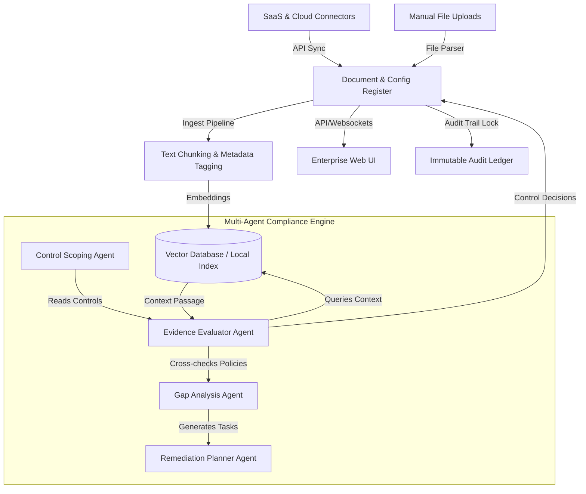

# ComplyFlow AI — Compliance Evidence & Security Questionnaire Agent

ComplyFlow AI is a working compliance and security review agent for evidence-grounded control mapping, audit preparation, security questionnaire response drafting, missing evidence detection, policy gap review, risk tracking, and exportable audit packages.

It is designed for real compliance-preparation workflows where teams need to upload policies, SOPs, evidence exports, vendor registers, access reviews, incident records, AI governance documents, and customer security questionnaires, then generate grounded outputs with human review.

## Core features

- Upload PDF, DOCX, TXT, MD, CSV, XLSX, JSON evidence files
- Built-in readiness checklists for:
  - SOC 2 Readiness
  - ISO 27001 Readiness
  - GDPR Readiness
  - AI Governance Readiness
  - EU AI Act Readiness
- Evidence retrieval using local vector search (Gemini text-embedding-004) with TF-IDF fallback
- AI-assisted control mapping with strict evidence-only prompts
- Missing evidence and policy gap detection
- Risk register generation
- Security questionnaire answer drafting with inline edits and a persistent **Knowledge Base learning loop**
- **Gated Customer Trust Center** with click-wrap NDA signup registers for secure document sharing
- **Collaborative Auditor Portal** with status validation, review remarks, and SHA-256 cryptographic audit locks
- **Persistent Relational Database** (SQLite) to store signed NDAs, override answers, audit locks, and comments
- Source quotes and evidence IDs for every control and answer
- Audit package export as JSON, Markdown, CSV, and ZIP
- Failure-safe local fallback if the API key is missing or the API call fails
- Black/white Streamlit interface with readable buttons and text

## System Architecture & Processing Flow

ComplyFlow AI leverages a hybrid retrieval and multi-agent workflow to automate compliance checks.



### Ingestion Flow
1. **Telemetry & Document Collection**: Telemetry from AWS Security Hub or GCP Security Command Center is combined with manual evidence file uploads.
2. **Text Chunking**: Files are broken down into overlapping, semantic text windows.
3. **Hybrid Embedding Index**: Text chunks are embedded using Gemini's `text-embedding-004` model when active (falling back to a local TF-IDF vector matrix if no API key is provided).

### Agent Reasoning Loop
1. **Scoping**: Maps controls corresponding to selected frameworks (SOC 2, ISO 27001, GDPR, EU AI Act).
2. **Retrieval**: Searches the index using cosine similarity to extract the most relevant evidence chunks.
3. **AI Review**: A batch process evaluates evidence strength against control criteria, marking statuses, risk ratings, and highlighting policy gaps.

## Tech stack

- Python
- Streamlit
- Google GenAI SDK
- Pandas
- scikit-learn TF-IDF retrieval
- pypdf
- python-docx
- openpyxl
- Plotly

## Setup

Create and activate a virtual environment.

### Windows PowerShell

```powershell
python -m venv .venv
.\.venv\Scripts\activate
pip install -r requirements.txt
copy .env.example .env
```

Edit `.env` and add your key:

```env
GEMINI_API_KEY=your_real_key_here
GEMINI_MODEL=gemini-2.5-pro
```

Run:

```powershell
streamlit run app.py
```

or:

```powershell
.\run_windows.bat
```

### macOS / Linux

```bash
python3 -m venv .venv
source .venv/bin/activate
pip install -r requirements.txt
cp .env.example .env
streamlit run app.py
```

## How to test quickly

1. Keep **Include sample evidence** enabled.
2. Select **SOC 2 Readiness**, **ISO 27001 Readiness**, **AI Governance Readiness**, and **EU AI Act Readiness**.
3. Click **Run compliance analysis**.
4. Open **Control Mapping** and review evidence quotes.
5. Open **Questionnaire** and click **Generate grounded answers**.
6. Open **Audit Package** and download the full ZIP.

## Real workflow usage

Upload files such as:

- Security policy
- Incident response plan
- Access review CSV
- Vendor register
- Backup restore evidence
- Vulnerability scan summaries
- Change management exports
- AI system inventory
- Model evaluation reports
- Customer security questionnaire

The app will map evidence to controls, detect missing proof, draft questionnaire responses, and prepare an audit package.

## Important safety notes

- The app requires human review before submitting any customer, legal, audit, or compliance response.
- The built-in framework checklists are readiness workflows, not official certification decisions.
- Final compliance interpretation should be reviewed by qualified legal, security, or audit professionals.
